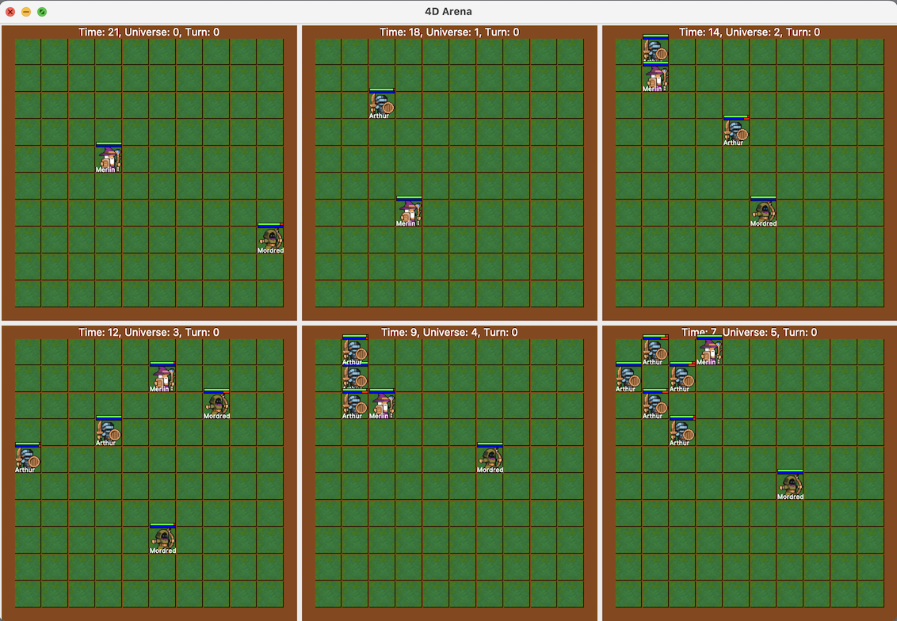

# 4D Battle Game Simulator

This is a simulator for a 4D battle game. The game is played on a **4D grid**, where each player has a **4D character**. The characters can move in 4D space and can attack each other. The goal of the game is to be the last player standing. A high-level logic of the game is implemented in Prolog, and the game is simulated in Python.



## Getting Started
To run the game, you need to have **Python 3.6 or higher** installed. You can download Python from [here](https://www.python.org/downloads/). If you want to modify the game logic, you need to have **SWI-Prolog** installed. You can download SWI-Prolog from [here](https://www.swi-prolog.org/download/stable).

### Prerequisites
- Python 3.6 or higher
- SWI-Prolog (only for development purposes)

## Game Rules and Logic

### Agents
There are three different agent classes: **warrior**, **wizard**, and **rogue**.
- Warrior: Heavy-armored class, dealing high damages in close range.
- Wizard: Can send magic missiles from afar, useful for hit-and-run strategy. Time/universe jumps cost less mana for wizards.
- Rogue: Uses bows for ranged attacks, though shorter than magic missile.

**Agent Properties:**
- Health decreases when attacked.
- Mana decreases when jumping between time/universe.
- Agility protects from magic missiles.
- Armor protects from melee and ranged attacks.
- Name is an arbitrary name of the agent.

### Actions
Actions available to agents:
- Move right: Increases the x property of the agent if possible.
- Move up: Increases the y property of the agent if possible.
- Move left: Decreases the x property of the agent if possible.
- Move down: Decreases the y property of the agent if possible.

If the agent is at edges of the map or the cell is occupied, move actions do not work.

**Portal Actions:**
- Portal (UniverseId, Time): Jumps to the state at Time on UniverseId.
- Portal_to_now (UniverseId): Jumps to the state with the current time on UniverseId. Does not create a new universe.

**Combat Actions:**
- Melee attack (TargetAgentId) (only warriors)
- Magic missile (TargetAgentId) (only wizards)
- Ranged attack (TargetAgentId) (only rogues)

**Other Actions:**
- Rest: Increases the mana property of the agent by 1.

If an agent’s health drops to 0, the agent is removed from the game.

### Time/Universe Travel
Agents can travel in time and universe. Each universe has a unique id. Time and universe travel are implemented similarly to [5D-Chess with Multiverse Time Travel](https://store.steampowered.com/app/1349230/5D_Chess_With_Multiverse_Time_Travel/).

## Running Game Simulator 
To run the game simulator, use the following command in the terminal:
```bash
python3 render.py scene_name.pro number_of_turns
```

For example, to run the game with 10 turns, you need to run the following command:
```python3 render.py scene1.pro 10```

## Game Scenes
There are 3 different game scenes. You can find the prolog files for the scenes in the scenes folder. You can also create your own scenes by defining the agents and their properties in a prolog file.


# Conclusion
This project is a part of Principles of Programming Languages course at Bogazici University. The project is implemented by [Soner Kuyar](github.com/sonerkuyar).


